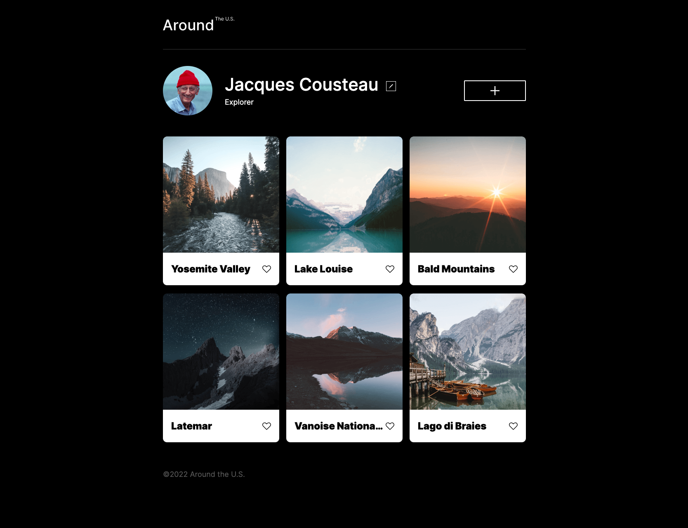

# Project 3: Around The U.S.

### Overview

- Intro
- Figma
- Images

**Intro**

This project is made so all the elements are displayed correctly on popular screen sizes. We recommend investing more time in completing this project, since it's more difficult than previous ones.  

**Figma**

- [Link to the project on Figma](https://www.figma.com/file/ii4xxsJ0ghevUOcssTlHZv/Sprint-3%3A-Around-the-US?node-id=0%3A1)

**Images**
here is an example 

The way you'll do this at work is by exporting images directly from Figma — we recommend doing that to practice more. Don't forget to optimize them [here](https://tinypng.com/), so your project loads faster.

Good luck and have fun!

**AboutMe**

Hello my name is Joshua B. Zimmerman. This project is remake as I dumped the previous project and I needed to retry to completely understand what I was doing. I have built a design based on a FIGMA shared project, additionally I have improvised troubleshooting, testing and released this project on gitPages.

This project shows a usage of a shared FIGMA project ui file, containing both desktop projects, and mobile project with specific size settings, styling and resolutions. This is a project that is meant to represent an a example of a unifiied and dynamic website. This is to be used as a growing, and changing project thoughout the rest of class, more to come !!!!

To view this iteration of this first stage of the project: click here: https://zimmermanjosh.github.io/se_project_aroundtheus/

**Updates and Development**
this project revision is adding a scripts_folder to the project, additionally we are adding javascript (.js) to the project.
