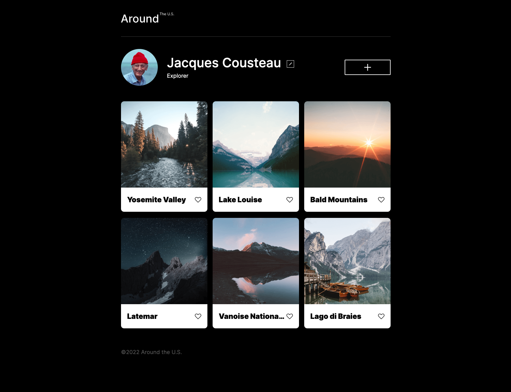

# Sprint8 : part 4/4

This project includes:
refactor of class js files 
refactor of projects 
webpack add 
babel add 

# Project 8 updated: Around The U.S.
- review #3

### Overview

- Intro
- Figma
- Images
- javscript
- html
- added css

**Intro**

This project is made so all the elements are displayed correctly on popular screen sizes. We recommend investing more time in completing this project, since it's more difficult than previous ones.

**Figma**

project has been updated locally.

**Images**
here is an example ::

The way you'll do this at work is by exporting images directly from Figma — we recommend doing that to practice more. Don't forget to optimize them [here](https://tinypng.com/), so your project loads faster.

Good luck and have fun!

**AboutMe**

Hello my name is Joshua B. Zimmerman. This project is remake as I dumped the previous project and I needed to retry to completely understand what I was doing. I have built a design based on a FIGMA shared project, additionally I have improvised troubleshooting, testing and released this project on gitPages.

This project shows a usage of a shared FIGMA project ui file, containing both desktop projects, and mobile project with specific size settings, styling and resolutions. This is a project that is meant to represent an a example of a unifiied and dynamic website. This is to be used as a growing, and changing project thoughout the rest of class, more to come !!!!

To view this iteration of this first stage of the project: click here: https://zimmermanjosh.github.io/se_project_aroundtheus/

**Updates and Development**

## sprint 7 updates
This project includes:
- cards.js implementation
- sprint 7 sub
- Form validation
- esc key bindings for javascript

this is revision for sprint 7
## Updating the project's file structure
- Since we'll be refactoring our project using OOP, we'll update the directory structure a bit. Create two new folders: /components and /utils. The first will store your class components. The latter will store some utility functions. We'll describe their contents later.
- Then, move your index.js file to the pages directory. Make sure to update the filepath in your <script> tag accordingly.
- The /scripts directory with validator.js can be deleted.
- This is what your file structure should look like after the changes:
- se_project_aroundtheus/
  -- components/
      -- Card.js
      -- FormValidator.js
  -- pages/
     -- index.js
     -- index.css
  -- utils/
     -- utils.js ...everything else
## Creating the Card and FormValidator classes
- Create the Card class, which creates a card with text and an image link, as per the following requirements:
- It takes card data — text and a link to the image — and a template element selector as parameters into the constructor.
- It has private methods for working with markup and adding event listeners.
- It has private methods for each event handler.
- It has one public method that returns a fully functional card element populated with data.
## Create a Card class instance for each card.
## Create the FormValidator class, which sets settings for validating form fields according to the following requirements:
- Its constructor has two parameters. The first parameter is a settings object that stores selectors and form classes, and the second one takes a form element to be validated.
- It has private methods for processing the form, which include: checking the field's validity, changing the state of the Submit button, and adding all the needed handlers.
- It has a public method enableValidation(), which enables form validation.
- It has a public method to either disable the state of the button or reset form validation (including the state of the submit button).
- Create an instance of the FormValidator class for each form that should be validated.
## Code requirements
This project will be different from your previous projects. Before, you were required to code and implement various features yourself, for example, adding functioning buttons or making a popup appear and then disappear. But this time, all the functionality is already there, and your task is to organize the code.
The first requirement is to add the Card and FormValidator classes to the code and ensure that each of them performs one specific task. These classes should contain all the necessary code for performing their respective tasks.
The second requirement is to divide the JavaScript code into modules. Your project will include four scripts:
Card.js will contain the code of the Card class.
FormValidator.js will contain the code of the FormValidator class.
utils.js will contain the event handlers and the function that opens/closes modal windows.
index.js will contain the rest of the code (you may have noticed that in some lessons we referred to this file as script.js; both index.js and script.js are common naming conventions for the main script file).
The Card and FormValidator classes should be exported from their corresponding files, and then you will need to import and implement them inside of index.js.
Ensure that the JS files are connected to index.html as modules.

## sprint 6
this project revision is adding a scripts_folder to the project, additionally we are adding javascript (.js) to the project.
Project sprint 6
Dev Updates

- Step 1. Validating the "Edit Profile" Form
- if a field of the "Edit profile" form doesn't pass the validation, a red error message should be displayed underneath it
- Validation settings are as follows:Both fields are required.
  - The "Name" field must contain between 2 and 40 characters.
  - The "About" field must contain between 2 and 200 characters.
    Use the default error messages of the browser.
    If any field doesn't pass validation, the "Save" button should be inactive. If both fields pass validation, then they should be active. Use the colors from the design for the inactive buttons.
    Note that after adding a new card and reopening the modal window, a user can create an empty card. We need to make it unavailable for the user to do that. When opening a modal window, if you reset the values of the input fields, make sure to disable the save button and add the corresponding class to it.
- Step 2. Validating the "New Place" Form
- Validation settings are as follows: Both fields are required.
  - The "Title" field must contain between 1 and 30 characters.
  - The "Image URL" field must contain a URL.
  - Use the default error messages of the browser.
  - If any field doesn't pass validation, the "Save" button should be inactive. If both fields pass validation, then it should be active. Inactive button colors are the same as for the "Edit profile" form.
- Step 3. Closing the Popup by Clicking on the Overlay
  - Code a feature that allows the users to close the popup by clicking on the overlay, i.e. anywhere outside the popup's borders
- Step 4. Closing the Popup by Pressing Esc
  - Code a feature that allows the users to close the popup by pressing the Esc key.
